# The Transverse-Field Ising Model on a Quantum Computer

*Quantum Computing course project — using PennyLane and the `qspin` dataset.*

---

## Abstract

We study the transverse-field Ising model (TFIM) using PennyLane's `qspin`
dataset as an exact ground-truth oracle, cross-validating it with an
independent analytic (Jordan-Wigner) solution, and reconstructing its physics
variationally on a simulated gate-based device (VQE). From exact
diagonalization we locate the quantum critical point via two independent
finite-size proxies (magnetization inflection and Binder-cumulant crossing),
extract the entanglement central charge (finding that a known open-chain
boundary artifact, not our method, is responsible for its bias away from the
CFT value $c=1/2$, resolved by refitting on periodic chains), and show that
periodic boundary conditions converge to the exact critical field $h_c=1$
far faster with system size than open ones. We also probe the 2D
(rectangular) lattices, absent from the original scope, and the classical-
shadow data, reconstructing a shot-noisy order parameter with no access to
the exact statevector. On the variational side, a physics-informed
Hamiltonian Variational Ansatz beats a generic hardware-efficient one by
roughly $23\times$ in energy accuracy at $N=8$ — a gap that widens to
$\sim\!85\times$ at $N=16$ — and avoids the barren plateaus that increasingly
cripple the generic ansatz as $N$ grows.

## 1. Introduction

Phase transitions are the sharpest phenomenon in statistical physics: a
macroscopic system's qualitative behaviour can change abruptly as a single
external parameter is tuned, even though the microscopic Hamiltonian changes
smoothly with it. The transverse-field Ising model (TFIM) is the canonical
system in which this phenomenon survives all the way down to zero
temperature, where it is driven not by thermal fluctuations but by quantum
fluctuations alone — a **quantum phase transition** (QPT). It is exactly
solvable in one dimension, hosts a genuine continuous quantum critical point,
and is small enough to simulate exactly on a classical computer up to
$N\sim20$ spins while also being a natural target for near-term quantum
hardware. This combination — rich statistical-mechanics content, a known
exact answer at every accessible size, and a direct route to variational
quantum algorithms — is why we use it here as a testbed for both classical
verification tools and quantum simulation.

The goal of this project is threefold: (i) build the classical and quantum
statistical-mechanics background needed to state precisely what is being
transitioned between and why (Sec. 2–3); (ii) reproduce that physics from
PennyLane's `qspin` dataset, an exact-diagonalization oracle, cross-checked
against an independent analytic solution (Jordan-Wigner) and, separately,
against a genuinely NISQ-realistic classical-shadow reconstruction; and
(iii) reconstruct the same ground states variationally (VQE) on a simulated
gate-based device, comparing a generic hardware-efficient ansatz against one
built from the problem's own symmetry structure.

## 2. Classical phase transitions and the Ising model

Before turning on the transverse field, it is worth being precise about what
a phase transition *is*, since the same vocabulary — order parameter, broken
symmetry, critical exponent — carries over essentially unchanged to the
quantum case in Sec. 3.

### 2.1 Phases, order, and broken symmetry

A phase transition occurs when a phase becomes unstable under the governing
thermodynamic potential (e.g. the Gibbs free energy $G(N,p,T)=U-TS+pV$ at
fixed $\{N,p,T\}$): the equilibrium state is whichever minimizes that
potential, and a transition is the point where the minimizer changes.
Many transitions are also **symmetry-breaking**: the high-temperature
(disordered) phase is invariant under some symmetry group $G$ of the
Hamiltonian, while the low-temperature (ordered) phase is invariant only
under a subgroup $H\subset G$. The classical Ising model,
$$ H = -\tfrac12\sum_{i,j\,\text{n.n.}} J\,\sigma_i\sigma_j, \qquad \sigma_i=\pm1, $$
is invariant under the global spin-flip $\hat I:\sigma_i\to-\sigma_i$ for
every $i$ (a $\mathbb{Z}_2$ symmetry) when there is no external field. Above
the Curie temperature $T_C$ the equilibrium magnetization is zero and this
symmetry is intact; below $T_C$ the system spontaneously magnetizes in one
of two directions, and $\hat I$ is spontaneously broken. The **order
parameter** — here the magnetization $m$ — is the natural (if informal)
quantity Landau introduced to measure how ordered the low-symmetry phase is:
zero in the disordered phase, nonzero (and non-unique, since either sign is
an equally good ground state) in the ordered one.

### 2.2 Classifying phase transitions

Ehrenfest's classification sorts transitions by which derivative of the
thermodynamic potential first becomes singular. **First-order** transitions
have a discontinuity in a first derivative of $G$ (e.g. $S=-(\partial
G/\partial T)_p$, giving a latent heat) and generically exhibit phase
coexistence. **Continuous** transitions have continuous first derivatives
but a divergence or discontinuity in a second derivative (specific heat,
susceptibility, correlation length) — the historical name "second order" is
somewhat misleading, since at a genuine continuous transition these
quantities typically show power-law (or worse) singularities, not merely a
plain jump.

### 2.3 Landau theory and critical exponents

Landau's phenomenological theory sidesteps computing the partition function
of a specific microscopic Hamiltonian entirely: given an order parameter
$\Psi$ and a free-energy density $f(\Psi,T)$ built only from the symmetry of
the problem, expand $f$ near the transition. For a system with the
$\Psi\to-\Psi$ symmetry (no external field),
$$ f(\Psi,T) = \tfrac12 a_2(T)\Psi^2 + \tfrac14 a_4(T)\Psi^4 + \dots, \qquad a_4(T)>0, $$
and a transition at $a_2(T_C)=0$, with $a_2(T)\approx \bar a_2(T-T_C)$ near
$T_C$. Minimizing $f$ gives the equilibrium order parameter
$\Psi=\pm\sqrt{-a_2/a_4}$ for $T<T_C$ (two degenerate equilibria — the broken
symmetry made explicit) and $\Psi=0$ for $T>T_C$. This single calculation
already produces the **mean-field critical exponents**
$$ \Psi\sim(T_C-T)^\beta,\ \beta=\tfrac12; \qquad
   \Psi\sim h^{1/\delta},\ \delta=3; \qquad
   \chi\sim|T-T_C|^{-\gamma},\ \gamma=1; \qquad
   C_V\sim|T-T_C|^{-\alpha},\ \alpha=0\ \text{(jump)}, $$
identical to the exponents of mean-field theory (Landau theory *is* the
phenomenological form of mean-field theory near $T_C$, though unlike a
microscopic mean-field calculation it cannot predict $T_C$ itself). These
mean-field values are exact only above the model's upper critical dimension;
the Ginzburg criterion $\langle(\delta\Psi)^2\rangle\ll\langle\Psi\rangle^2$
quantifies when fluctuations can safely be neglected, which for the Ising
universality class requires $d>4$.

### 2.4 The classical Ising model and the role of dimensionality

Mean-field theory becomes exact only as the number of interacting neighbours
$n_{nn}\to\infty$ (infinite range, or infinite dimension); at finite,
short-range $d$ its predictions for $T_C$ and the critical exponents are
systematically wrong, and the error *worsens* as $d$ decreases. The 1D
Ising chain is the extreme case: it has **no finite-temperature phase
transition at all** ($T_C=0$), even though mean-field theory incorrectly
predicts one. The reason is an energy–entropy argument: introducing a single
domain wall into an otherwise ordered 1D chain costs a fixed energy $2J$
independent of the chain length $N$, but there are $\sim N$ places to put it,
so the free-energy cost $\Delta F = 2J - k_BT\ln N$ becomes negative for any
$T>0$ as $N\to\infty$ — domain walls proliferate and destroy order at any
nonzero temperature. In 2D and above, a domain wall's energy cost instead
scales with its *boundary length*, which grows with the enclosed area, and
long-range order survives up to a finite $T_C$ (exactly solvable in 2D,
Onsager 1944). This dimension-dependence of whether short-range interactions
alone can sustain order at $T>0$ is the classical precursor to the quantum
story in Sec. 3.4: the model we study here is precisely the 1D chain that
mean-field theory gets qualitatively wrong at finite temperature — and yet,
as we will see, tuning a transverse field at $T=0$ produces a genuine,
non-mean-field phase transition even in 1D.

## 3. Quantum phase transitions and the transverse-field Ising model

### 3.1 From classical to quantum spins

The classical Ising spin $\sigma_i=\pm1$ is promoted to a quantum operator by
identifying it with the Pauli matrix $\hat\sigma_i^z$ acting on a spin-1/2
(qubit) at site $i$, with basis states $|{\uparrow}\rangle,|{\downarrow}\rangle$
its $\pm1$ eigenstates. The classical Hamiltonian, which commutes with every
$\hat\sigma_i^z$ and is therefore already diagonal (no quantum dynamics), is
made genuinely quantum by adding a term built from the *non-commuting*
operator $\hat\sigma_i^x$ — the transverse field — which does not commute
with $\hat\sigma_i^z$ and so induces quantum-mechanical tunnelling between
classical Ising configurations.

### 3.2 The transverse-field Ising Hamiltonian

$$ \hat H = -J\sum_{\langle i,j\rangle}\hat\sigma_i^z\hat\sigma_j^z
          - h\sum_i \hat\sigma_i^x $$
(equivalently, in the dataset's sign convention with $J\to-J$ absorbed into
the coupling, $\hat H = J\sum_{\langle i,j\rangle}\hat\sigma_i^z\hat\sigma_j^z
+h\sum_i\hat\sigma_i^x$ with $J=-1$, as used throughout this report). Writing
$g=h/|J|$ for the dimensionless field, the two terms compete: the coupling
term favours parallel neighbouring spins along $z$ (ferromagnetic order),
while the field term favours every spin aligning along $x$ — the
$\hat\sigma_i^x$ eigenstate $|{\to}\rangle_i=(|{\uparrow}\rangle_i+|{\downarrow}\rangle_i)/\sqrt2$
— which has *no* definite $z$-magnetization at all. Order parameter:
longitudinal magnetization $\langle|M_z|\rangle=\langle|\sum_i\hat\sigma_i^z|\rangle$,
exactly as in the classical model.

### 3.3 Two solvable limits and the quantum phase transition

The two extreme limits of $g$ are exactly solvable and qualitatively
different, which is itself the argument for a transition somewhere between
them:

- **$g\gg1$ (field-dominated).** To leading order the ground state is the
  uncorrelated product $|0\rangle=\prod_i|{\to}\rangle_i$: every spin's
  $z$-magnetization is completely uncorrelated with every other,
  $\langle0|\hat\sigma_i^z\hat\sigma_j^z|0\rangle=\delta_{ij}$. This is the
  **paramagnetic (disordered)** phase; perturbative corrections in $1/g$
  build in short-ranged correlations, $\langle\hat\sigma_i^z\hat\sigma_j^z
  \rangle\sim e^{-d_{ij}/\xi}$, but the phase remains disordered.
- **$g\ll1$ (coupling-dominated).** The ground state is one of the two
  classical ferromagnetic configurations, $\prod_i|{\uparrow}\rangle_i$ or
  $\prod_i|{\downarrow}\rangle_i$ (or, on a finite lattice, an
  exponentially-close-to-degenerate symmetric/antisymmetric combination of
  the two). This is the **ferromagnetic (ordered)** phase, spontaneously
  breaking the Hamiltonian's $\mathbb{Z}_2$ spin-flip symmetry
  ($\hat\sigma_i^z\to-\hat\sigma_i^z\ \forall i$, under which $\hat H$ is
  invariant but the two ground states are exchanged) exactly as in the
  classical model of Sec. 2.1.

A **quantum phase transition** is any point of non-analyticity in the ground-
state energy of the infinite system as a function of the coupling — here
$g$ — at $T=0$, and it is driven by the Heisenberg-uncertainty-induced
quantum fluctuations from the non-commuting $[\hat\sigma^x,\hat\sigma^z]\neq0$,
not by thermal ones. As with classical transitions (Sec. 2.2), a first-order
QPT has a discontinuous first derivative of the ground-state energy density;
a continuous QPT has a discontinuous or divergent second (or higher)
derivative, the first derivative remaining continuous. On a *finite* lattice
the ground-state energy is generically a smooth, analytic function of $g$ (an
avoided level-crossing between the ground and first excited state); true
non-analyticity — and hence a genuine QPT — only emerges in the
$N\to\infty$ limit, as the avoided crossing sharpens into an exact one.

### 3.4 Non-analyticity, the quantum-to-classical mapping, and the phase diagram

For the 1D transverse-field Ising chain the location of this non-analyticity
can be found exactly via a **quantum-to-classical (QC) mapping**: writing the
quantum partition function $Z=\mathrm{Tr}(e^{-\beta\hat H})$ as a
Suzuki-Trotter product over $M$ imaginary-time slices and inserting
completeness relations at each slice turns $Z$ into the partition function
of a *classical*, two-dimensional, anisotropic Ising model, with the quantum
chain's $N$ sites along one direction and the $M\to\infty$ imaginary-time
slices along the other:
$$ Z_{\text{quantum 1D}} \;\cong\; Z_{\text{classical 2D}}
   = \Lambda^{N_xN_y}\!\!\sum_{\{s_{i,l}=\pm1\}}
     \exp\Big[\beta^*J_x\!\sum_{i,l}s_{i,l}s_{i+1,l} + \beta^*J_y\!\sum_{i,l}s_{i,l}s_{i,l+1}\Big], $$
with $\beta^*J_x=\beta J/M$ and $\beta^*J_y=\gamma=-\tfrac12\ln[\tanh(\beta
Jg/M)]$. This construction generalizes to any dimension: a $d$-dimensional
*quantum* system maps onto a $(d{+}1)$-dimensional *classical* one, the extra
dimension being imaginary time. Substituting Onsager's exact 1944 solution
for the 2D classical Ising critical point, $\sinh(2\beta J_x^c)\sinh(2\beta
J_y^c)=1$, into the identifications above and taking $M\to\infty$ at fixed
$\beta/M$ (i.e. $T\to0$ for the quantum chain) yields, after simplification,
the condition $g^c=1$ for *every* $J$ — an exact, non-perturbative derivation
that the 1D transverse-field Ising chain has a quantum critical point at
$g_c=h_c/|J|=1$. This is reproduced independently in this report by an
entirely different method (the Jordan-Wigner free-fermion solution,
Sec. 5.7), which gives the single-particle excitation gap
$\Delta(k)=2J\sqrt{1+g^2+2g\cos k}$ for the field-term sign convention used
in this derivation ($\hat H_0=-Jg\sum_i\hat\sigma_i^x$); relabelling $k\to
\pi-k$ over the (reflection-symmetric) set of allowed momenta shows this is
identical to $\varepsilon(k)=2\sqrt{1+h^2-2h\cos k}$ of Sec. 5.7, obtained for
the dataset's opposite-sign convention $+h\sum_i\hat\sigma_i^x$ — the
physical spectrum, and hence $g_c$, cannot depend on this sign choice. Either
way, the gap vanishes at $k=0,\,g=1$ — the hallmark of a continuous QPT
closing the energy gap above an otherwise gapped ground state.

Because the QC mapping trades the quantum coupling $g$ for an *anisotropy* in
an equivalent classical system rather than for a genuine second thermal
direction, the transition at $g_c$ remains strictly a $T=0$ phenomenon for
the chain: at any $T>0$ the imaginary-time extent $M=\beta/(\text{const.})$
stays finite as $N\to\infty$, so the effective classical system is an
infinite strip, not a genuine 2D lattice, and (echoing the classical 1D
result of Sec. 2.4) no finite-temperature transition survives. The resulting
phase diagram in the $(g,T)$ plane therefore has the transition confined to
the single point $(g_c,T=0)$ — the **quantum critical point** — with a
*quantum critical region* fanning out from it at $T>0$ where the physics is
governed by neither ground state but by thermally-populated critical
fluctuations. (In a genuinely 2D quantum Ising model in a transverse field,
by contrast, the $h=0$ line recovers the classical 2D Ising model's own
finite-$T$ transition, and the phase diagram acquires an entire line of
finite-$T$ critical points running into the $T=0$ quantum critical point —
the setting for the 2D lattices probed in Sec. 6.7.)

### 3.5 Entanglement near a quantum critical point

Because a QPT is a property of the many-body *ground state* rather than of a
thermal ensemble, it can equally be diagnosed through the ground state's
quantum correlations — its **entanglement** — rather than through energy
derivatives alone. For a pure bipartite state $|\Psi\rangle$ split into
regions $A$ and $B$, the Schmidt decomposition
$|\Psi\rangle=\sum_k d_k|u_k\rangle_A|v_k\rangle_B$ gives reduced density
matrices $\hat\rho_A=\sum_k|d_k|^2|u_k\rangle\langle u_k|$ (similarly for
$B$) whose eigenvalues are the squared Schmidt coefficients; the **entropy of
entanglement** $S(\hat\rho_A)=-\mathrm{Tr}(\hat\rho_A\ln\hat\rho_A)$ is zero
for a product state and maximal for a maximally-entangled state such as a
Bell pair. For the ground states of gapped, short-range-interacting
Hamiltonians, entanglement typically obeys an **area law**: $S$ scales with
the size of region $A$'s *boundary*, not its volume, because only degrees of
freedom within a correlation length $\xi$ of the boundary are entangled
across it. Precisely at a continuous QPT, $\xi$ diverges and the area law is
violated: for the 1D transverse-field Ising chain the half-chain entropy
instead grows *logarithmically* with subsystem size at $g=g_c$, with a
universal coefficient fixed by the central charge $c$ of the associated
conformal field theory ($c=1/2$ for the Ising universality class) — the
Calabrese-Cardy relation exploited in Sec. 5.2 and 6.2. Away from
criticality, the exact entanglement entropy of the TFIM ground state is
known in closed form in terms of complete elliptic integrals (Calabrese &
Cardy 2004), and correctly predicts $S\to\ln2$ deep in the ordered phase
($g\to0$) — the two-fold ground-state degeneracy from the broken
$\mathbb{Z}_2$ symmetry of Sec. 3.3 manifesting as a maximally-entangled
cat-state superposition of the two symmetry-broken branches, exactly the
plateau found in our own data (Sec. 6.2) — and $S\to0$ deep in the
paramagnetic phase ($g\to\infty$), where the unique product ground state
$\prod_i|{\to}\rangle_i$ carries no entanglement at all.

## 4. The dataset

All results in this report are built on PennyLane's **`qspin`** dataset
collection, accessed through `qml.data.load`. The collection bundles
exact-diagonalization data for several quantum spin models; we use the
**`Ising`** system, i.e. the transverse-field Ising model of Section 3.

### 4.1 What a "system" is
A single dataset object is fully specified by four discrete choices:

| selector | meaning | values used here |
|---|---|---|
| `sysname` | spin model | `"Ising"` |
| `periodicity` | boundary conditions | `"open"` (a finite chain with two ends) or `"closed"` (a ring, periodic) |
| `lattice` | geometry | `"chain"` (1D) or `"rectangular"` (2D) |
| `layout` | size as `rows x cols` | chain: `1x4`, `1x8`, `1x16`; rectangular: `2x2`, `2x4`, `2x8`, `4x4` |

The number of spins is $N = \text{rows}\times\text{cols}$, so the available
system sizes are $N \in \{4, 8, 16\}$. Every (periodicity, lattice, layout)
combination exists for both boundary conditions, giving $2\times(3+4)=14$
distinct systems. We load them with:

```python
ds = qml.data.load("qspin", sysname="Ising",
                   periodicity="open", lattice="chain", layout="1x16",
                   folder_path="data")[0]
```

(`load` returns a list; each system is one element. Files are cached as HDF5
under `folder_path/qspin/...` and require the `h5py`/`fsspec`/`aiohttp` extras.)

### 4.2 The field sweep
Each system is **not a single Hamiltonian** but a sweep: the transverse field
takes **100 equally spaced values** from $h=0$ up to a size-dependent maximum
($h_{\max}=3.0$ for `1x4`, $3.5$ for `1x8`, $3.75$ for `1x16`). The coupling is
fixed at the ferromagnetic value $J = -1$. Every per-state attribute below is
therefore an array of length 100, indexed by the field. The grid always
straddles the (thermodynamic-limit) critical point $h/|J| = 1$, which is what
lets us probe both phases and the transition between them.

### 4.3 Attributes of a datapoint
The exact attribute names (verified by loading `Ising/open/chain/1x4`):

| attribute | type / shape | description |
|---|---|---|
| `parameters` | `dict`, `parameters["h"]` shape `(100,)` | the 100 transverse-field values |
| `hamiltonians` | list of 100 `qml.Hamiltonian` | $H(h)= -\sum_{\langle i,j\rangle}\sigma^z_i\sigma^z_j + h\sum_i\sigma^x_i$, one per field |
| `ground_energies` | `complex128` `(100,)` (imag $\approx 0$) | exact ground-state energy $E_0(h)$ |
| `ground_states` | list of 100 vectors, each `(2**N,)` complex | exact ground-state wavefunction $\lvert\psi_0(h)\rangle$ |
| `order_params` | `complex128` `(100,)` (imag $\approx 0$) | magnetization order parameter $\langle\lvert M_z\rvert\rangle$ |
| `num_phases` | `int` $= 2$ | ordered (ferromagnetic) and disordered (paramagnetic) |
| `shadow_basis` | `int8` `(100, 1000, N)` | classical-shadow measurement bases (see 4.4) |
| `shadow_meas` | `int8` `(100, 1000, N)` | classical-shadow outcomes (see 4.4) |
| `spin_system` | `dict` | metadata: model name, the tuned `parameter`, the LaTeX `ham_eq`, and the `order_params` definition |

The `hamiltonians` are full PennyLane observables: for the open 4-site chain at
$h\approx1.515$ the stored operator reads
`-1·(Z0@Z1) -1·(Z1@Z2) -1·(Z2@Z3) + 1.515·(X0+X1+X2+X3)`, confirming the sign
convention and the nearest-neighbour bond structure. We exploit this directly:
`src/vqe_hva.py` reads the `PauliZ@PauliZ` terms as the lattice bonds and the
single-`PauliX` terms as the field sites, so our variational ansatz is built
from the dataset's own Hamiltonian rather than hard-coded.

### 4.4 Classical-shadow data
Beyond exact quantities, each field carries a **classical shadow**: 1000
randomized single-shot measurements of the ground state. For each shot,
`shadow_basis` records which random Pauli basis ($0,1,2 \leftrightarrow X,Y,Z$)
was measured on each of the $N$ qubits, and `shadow_meas` records the
corresponding $\pm1$ outcome encoded as a bit ($0,1$). This is exactly the data
a real (NISQ) device would return, and it allows reconstruction of observables
and entanglement proxies *without* access to the full statevector — a realistic
counterpoint to the exact `ground_states`. Used in Sec. 6.4 to reconstruct the
order parameter from shot noise alone.

### 4.5 How we use it
- **Exact baseline (Sec. 6):** `order_params` gives $\langle\lvert M_z\rvert\rangle$
  vs $h$ directly; `ground_states` gives everything else by linear algebra
  (entanglement entropy in Sec. 7, an independent magnetization check).
- **Ground truth for VQE (Sec. 5):** `ground_energies` is the variational
  target and the yardstick for our energy errors.
- **Finite-size scaling (Sec. 7):** comparing `1x4`, `1x8`, `1x16` at matched
  $h$ exposes how the transition sharpens toward $h/|J|=1$ as $N$ grows.

Our thin loader `src/loader.py` wraps `qml.data.load`, validates the
(lattice, layout) combination, strips the negligible imaginary parts, and
returns a typed `IsingData` dataclass; see `CLAUDE.md` for the live schema.

## 5. Methods

All code lives in `src/`, with a `pytest` suite in `tests/` (63 tests). The
software stack is PennyLane 0.45 on Python 3.12; statevector simulation uses
`lightning.qubit` with the `adjoint` differentiation method for the variational
work. Figures are generated into `plots/` and tabular results into `data/`.

### 5.1 Observables from the exact ground states
The dataset's `ground_states` are exact statevectors, so most quantities are
computed by direct linear algebra rather than sampling.

**Magnetization.** The order parameter is the longitudinal magnetization
$\langle\lvert M_z\rvert\rangle = \langle\lvert\sum_i\sigma^z_i\rvert\rangle$.
We reproduce it from a statevector (`abs_mz_from_state` in `src/vqe.py`) by
assigning each computational-basis state $\lvert b\rangle$ its total spin
$M_z(b)=\sum_i(1-2b_i)$ and averaging $\lvert M_z(b)\rvert$ over the Born
probabilities $\lvert\langle b\lvert\psi\rangle\rvert^2$. This independently
matches the dataset's `order_params` to $10^{-6}$ (a unit test), validating both
our convention and the qubit ordering.

**Entanglement entropy.** For a contiguous block $A=[0,\ell)$ we reshape the
$2^N$ statevector into a $2^\ell \times 2^{N-\ell}$ matrix and take its singular
values $\{s_k\}$ (a Schmidt decomposition). The reduced-density-matrix
eigenvalues are $p_k=s_k^2$, giving the von Neumann entropy
$S(\ell) = -\sum_k p_k\ln p_k$ (`entanglement_entropy` in
`src/entanglement.py`). This is numerically stable and avoids forming
$\rho_A$ explicitly.

### 5.2 Locating the transition
We use two finite-size proxies for the critical field, both expected to drift
toward the thermodynamic value $h/|J|=1$ as $N$ grows:
1. the steepest descent of the normalized magnetization,
   $\arg\max_h \lvert \mathrm{d}\langle\lvert M_z\rvert\rangle/\mathrm{d}h\rvert$;
2. the critical crossover of the half-chain entropy $S(h)$, located the same way
   (a literal maximum is masked by the $\ln 2$ symmetry-breaking plateau, see
   Sec. 7).

### 5.3 Central charge from entanglement scaling
At criticality the entropy of a block in an open chain follows the
Calabrese–Cardy law

$$ S(\ell) = \frac{c}{6}\,\ln\!\left[\frac{2N}{\pi}\sin\frac{\pi\ell}{N}\right] + c_1', $$

so plotting $S(\ell)$ for $\ell=1,\dots,N-1$ against the conformal coordinate
$x=\ln[(2N/\pi)\sin(\pi\ell/N)]$ should be linear with slope $c/6$. We take the
field point closest to $h=1$, fit a straight line by least squares
(`fit_central_charge`), and report $c = 6\times\text{slope}$. The symmetry-
breaking $\ln 2$ enters only the intercept $c_1'$, so the extracted $c$ is
unaffected by it.

### 5.4 Variational quantum eigensolver
To approximate the ground states on a (simulated) gate-based device we minimize
$\langle\psi(\boldsymbol\theta)\lvert H(h)\rvert\psi(\boldsymbol\theta)\rangle$
over circuit parameters. We compare two ansätze.

**Baseline — hardware-efficient.** `qml.StronglyEntanglingLayers` of depth $p$
(`run_vqe` in `src/vqe.py`): generic single-qubit rotations and entangling
CNOTs, initialized from small random angles. It knows nothing about the target.

**Physics-informed — Hamiltonian Variational Ansatz (HVA).** Motivated by
adiabatic evolution, alternating layers of the two non-commuting terms of $H$
(`run_vqe_hva` in `src/vqe_hva.py`):

$$ \lvert\psi(\boldsymbol\gamma,\boldsymbol\beta)\rangle =
   \prod_{p}\Big[\prod_i e^{-i\beta_p\sigma^x_i}\;
   \prod_{\langle i,j\rangle} e^{-i\gamma_p\,\sigma^z_i\sigma^z_j}\Big]\,
   \lvert-\rangle^{\otimes N}. $$

The ZZ bonds and field sites are read directly off the dataset Hamiltonian
(`extract_structure`), so the ansatz matches the actual lattice and boundary
conditions. The reference state is $\lvert-\rangle^{\otimes N}$, the exact
ground state as $h\to\infty$ (the field term $+h\sum_i\sigma^x_i$ is minimized
by the $\sigma^x=-1$ eigenstate). There are only two parameters per layer, the
ansatz respects the $\mathbb{Z}_2$ symmetry, and it largely avoids barren
plateaus.

**Optimization.** Adam (`qml.AdamOptimizer`) with exact (analytic) gradients via
the adjoint method and *convergence-based* early stopping (steps until the
energy plateaus, up to a 500-step ceiling) rather than a fixed budget — so a
deeper ansatz is never penalised merely for being under-trained. Because a VQE
outcome depends strongly on its random initialization, every reported point is
aggregated over several independent restarts (Sec. 5.5). Energies obey the
variational bound $E_{\mathrm{VQE}}\ge E_0$ (checked in tests).

**QAOA — digitized quantum annealing.** QAOA uses the same alternating ZZ/X
gate family but is interpreted as one Trotter step per layer of the adiabatic
sweep $H(s)=(1-s)H_B + s H_C$, $s:0\to1$. We exploit this with an
*annealing-inspired initialization* (`run_qaoa`, `anneal_init`): layer $k$ is
seeded at $s_k=(k+\tfrac12)/p$ with angles $\gamma_k=s_k\,\delta t$,
$\beta_k=(1-s_k)\,\delta t$, placing the optimizer in the basin a slow anneal
would follow. As $p\to\infty$ with a slow schedule QAOA reproduces the exact
adiabatic evolution; at finite $p$ the energy error measures the cost of
digitization. We compare this against the same circuit started from random
angles.

**Warm-start sweep.** Because consecutive fields have nearly identical ground
states (except at criticality), we sweep $h$ from high to low and initialize
each optimization from the previous field's optimal parameters
(`warm_start_sweep`). High $h$ is the easy end — $\lvert-\rangle^{\otimes N}$ is
already exact there — so the good solution is transported into the harder,
more-entangled small-$h$ region. The first (high-$h$) field uses the chosen
initialization (random for HVA, annealing for QAOA).

### 5.5 Benchmark protocol
`src/benchmark.py` runs VQE over a grid of system sizes $N\in\{4,8,16\}$ and
ansatz depths at field values evenly sampled across the sweep, recording
per-field absolute and relative energy error and order-parameter error into a
tidy CSV. Each grid point is repeated over several independent random restarts:
`summarize` reports, per $(N, \text{depth})$, the *median* restart error with an
inter-quartile band and a *best-of-restarts* curve (the accuracy actually
achievable), and `compare_ansatze` does the same per field for the
HEA-vs-HVA-vs-QAOA comparison of Sec. 6. Reported errors are
$\lvert E_{\mathrm{VQE}}-E_0\rvert$ against the dataset `ground_energies`. The
runs are embarrassingly parallel over $(N,\text{depth},\text{field},
\text{restart})$ and are distributed across CPU cores (`src/parallel.py`); the
error sweeps use single-precision statevectors, whose $\sim10^{-5}$ floor is far
below the errors plotted.

### 5.6 Trainability and barren plateaus
A flat optimization landscape — vanishing gradients — is the central obstacle to
scaling VQE. We diagnose it (`src/trainability.py`) by the variance of an
energy-gradient component over many random parameter initializations: if
$\mathrm{Var}[\partial_\theta\langle H\rangle]$ shrinks (exponentially) with $N$,
the ansatz is on a *barren plateau* and effectively untrainable at scale. We
average this variance over every gradient component (rather than reading a
single fixed angle, which would make the diagnostic sensitive to which
parameter happens to sit at that index). For the HEA the leading angle is an
$R_z$ acting on $\lvert0\rangle$ — an unobservable global phase with
identically zero gradient — so it is excluded from that average; the HVA's
first angle is instead a genuine $ZZ$ rotation with a nonzero (in fact the
largest) gradient, and is kept. We compare the generic HEA against the
structured HVA/QAOA across $N\in\{4,8,16\}$.

### 5.7 Independent analytic cross-check: Jordan-Wigner

Exact diagonalization from the dataset is itself a numerical method, so we
add a genuinely independent check: the Jordan-Wigner transformation maps the
periodic-chain TFIM onto free fermions with single-particle dispersion
$\varepsilon(k) = 2\sqrt{1+h^2-2h\cos k}$, and the finite-ring ground-state
energy is $E_0 = -\tfrac12\sum_m \varepsilon(k_m)$ over the anti-periodic
momenta $k_m=\pi(2m+1)/N$ of the even-fermion-parity sector
(`src/jordan_wigner.py`). This closed-form result requires no ED at all, and
agrees with the dataset's `ground_energies` on the closed (periodic) chain to
machine precision (Sec. 6.3).

### 5.8 Open vs. closed (periodic) boundary conditions

Every analysis above defaults to the open chain. `src/boundary_comparison.py`
repeats the two finite-size $h_c$ estimators (Sec. 5.2) on the closed
(periodic) chain and fits the same power law
$h_c(N) = h_c(\infty) - a\,N^{-1/\nu}$, to see whether removing the two open
ends changes how fast the finite-size estimate approaches $h_c=1$ (Sec. 7.1).

### 5.9 2D (rectangular) lattices

The `qspin` collection also ships rectangular layouts (`2x2`, `2x4`, `2x8`,
`4x4`), untouched until now. Each site has more nearest neighbours than in
the chain, so the transition is expected to shift to larger $h$, approaching
the known square-lattice thermodynamic-limit value $h_c/|J|\approx 3.044$
(quantum Monte Carlo) rather than the 1D value of 1
(`src/lattice_2d.py`). Of the four, only `4x4` is a genuine (small) square
lattice; `2x2`/`2x4`/`2x8` are two-leg ladders, geometrically closer to 1D.
We do **not** attempt a central-charge extraction here: 2D ground-state
entanglement follows a boundary-perimeter area law, not the 1D conformal log
law of Sec. 5.3, so the Calabrese-Cardy fit would not be physically
meaningful on these lattices.

### 5.10 Classical-shadow reconstruction of the order parameter

$\langle\lvert M_z\rvert\rangle$ is not a linear functional of the state (the
absolute value is nonlinear), so it cannot be estimated directly from
classical shadows. Instead `src/classical_shadow.py` estimates the quadratic
$\langle M_z^2\rangle = \sum_i\langle Z_i^2\rangle + \sum_{i\neq j}\langle
Z_iZ_j\rangle = N + \sum_{i\neq j}\langle Z_iZ_j\rangle$ — a genuine shadow
observable, using PennyLane's `qml.ClassicalShadow.expval` on the dataset's
`shadow_basis`/`shadow_meas` (1000 randomized single-qubit Pauli measurements
per field) — and reports $\sqrt{\langle M_z^2\rangle}$ as the order-parameter
proxy. In the ordered phase the ground state's $\lvert M_z\rvert$ distribution
is sharply two-valued ($\pm m$), where $\sqrt{\langle M_z^2\rangle}$ and
$\langle\lvert M_z\rvert\rangle$ coincide exactly; this is the one result in
the report obtained with genuine shot noise rather than the exact statevector.

## 6. Results

### 6.1 Order parameter, Binder cumulant, and data collapse

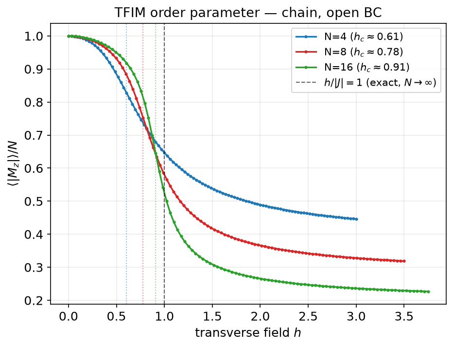

The normalized magnetization $\langle\lvert M_z\rvert\rangle/N$ falls from
$\approx 1$ at small $h$ to $\approx 0$ at large $h$ for every chain size,
sharpening around $h=1$ as $N$ grows — the expected finite-size rounding of a
thermodynamic-limit phase transition.

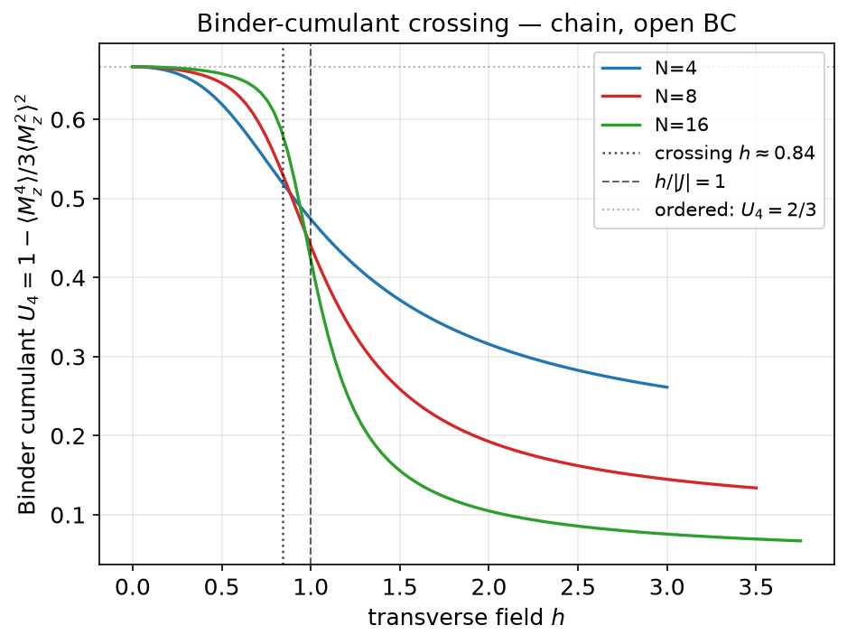

The Binder cumulant $U_4=1-\langle M_z^4\rangle/3\langle M_z^2\rangle^2$ is a
cleaner size-independent estimator: curves for different $N$ cross near
$h\approx0.84$, with much weaker finite-size drift than the magnetization
inflection point.

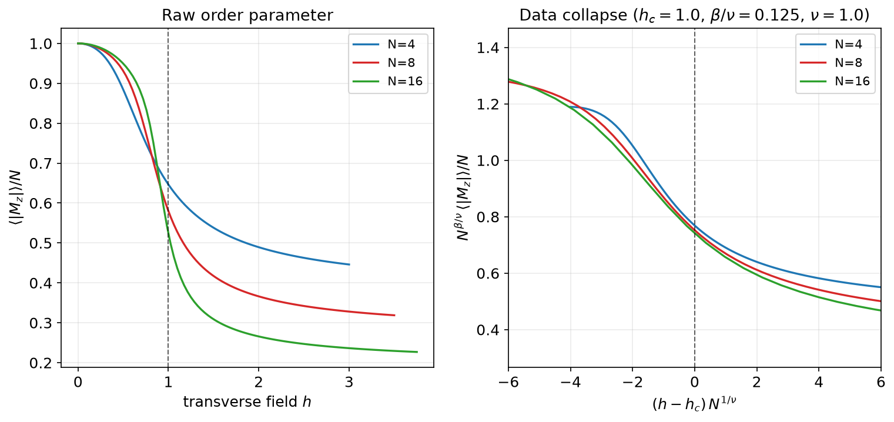

The finite-size data collapse, rescaling by the exact 2D-Ising exponents
$\beta/\nu=1/8$, $\nu=1$, brings all three chain sizes onto a single universal
curve (right panel) — strong evidence that the transition belongs to the
expected universality class.

### 6.2 Entanglement entropy and the central charge

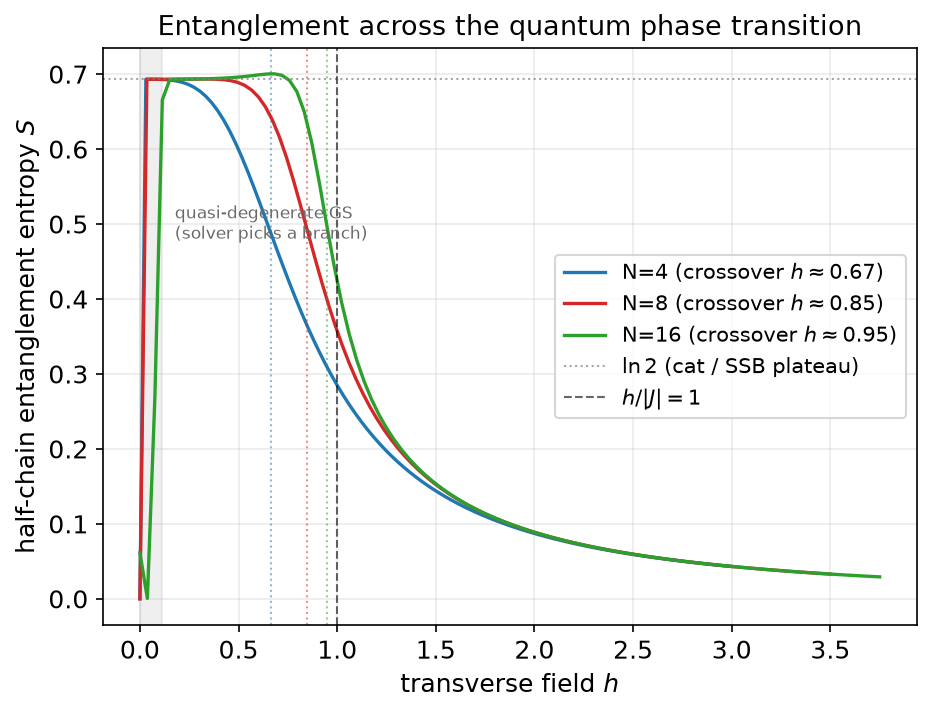

The half-chain entropy $S(h)$ rises with an area-law-like profile away from
$h=1$, peaks near criticality, and — in the ordered phase — plateaus at
$\ln 2$, the signature of the two-fold spontaneous symmetry breaking (a
cat-state superposition of the two ferromagnetic branches) rather than of any
residual entanglement.

The shaded band near $h=0$ (present for every $N$, widest for $N=16$) is a
genuine numerical artifact, not a bug: deep in the ordered phase the two
symmetry-broken branches are split by a finite-size tunnelling gap that
shrinks exponentially in $N$, so an eigensolver has no reason to return the
same member of that near-degenerate pair at adjacent field values — unlike
$S$, the order parameter $\langle|M_z|\rangle$ (which does not depend on
*which* near-degenerate eigenvector is returned) stays perfectly smooth
across the same region. `entanglement.quasi_degenerate_cutoff` detects and
shades this region automatically rather than hiding or smoothing it.

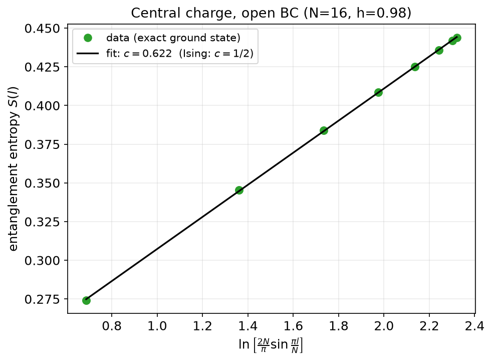

Fitting the Calabrese-Cardy law on the open chain gives $c\approx0.61$
($N=8$) and $c\approx0.62$ ($N=16$) against the Ising CFT value $c=1/2$ — a
persistent $\sim20\%$ overshoot.

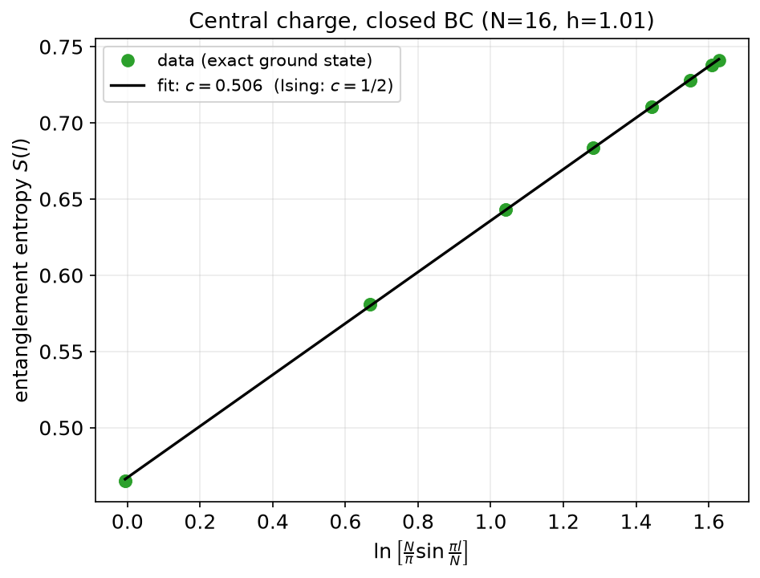

Refitting the *same* extraction on the closed (periodic) chain, where the
boundary-localized irrelevant operators responsible for the open-chain
correction (Calabrese & Cardy, arXiv:1002.4353) are absent, gives
$c\approx0.513$ ($N=8$) and $c\approx0.506$ ($N=16$) — within a few percent of
$1/2$ at the *same* system sizes. This confirms the open-chain bias was a
genuine finite-size boundary artifact, not a bug in the fit.

### 6.3 Jordan-Wigner cross-check

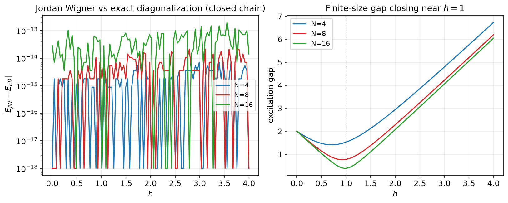

The closed-form free-fermion energy (Sec. 5.7) matches the dataset's exact
`ground_energies` on the closed chain to $10^{-13}$–$10^{-15}$ absolute error
for every field and every size $N\in\{4,8,16\}$ (left panel) — i.e. to
floating-point precision, not merely "good agreement". The right panel shows
the finite-size excitation gap closing near $h=1$ as $N$ grows, an entirely
independent confirmation of the critical point that involves no
diagonalization at all.

### 6.4 Classical-shadow reconstruction

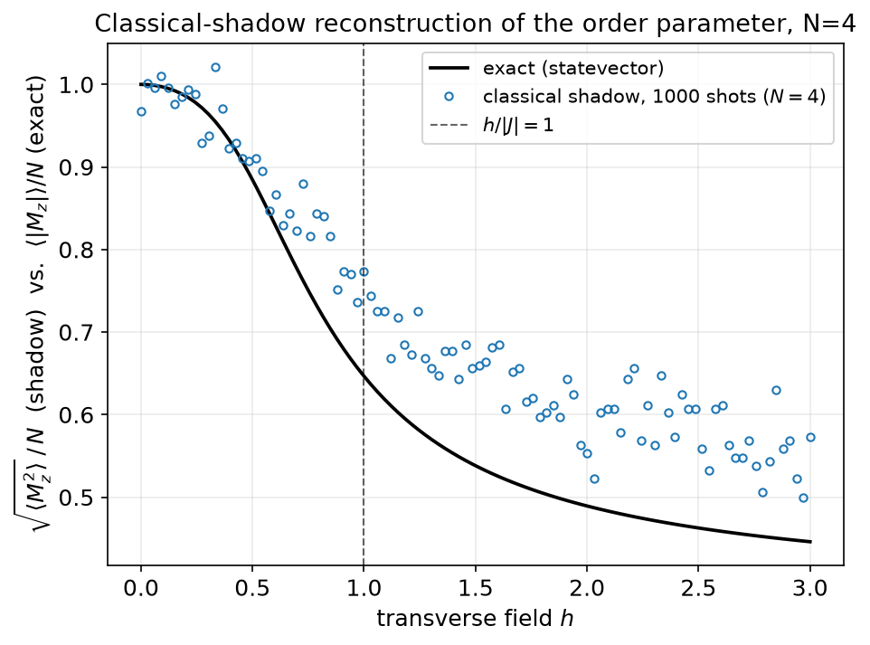

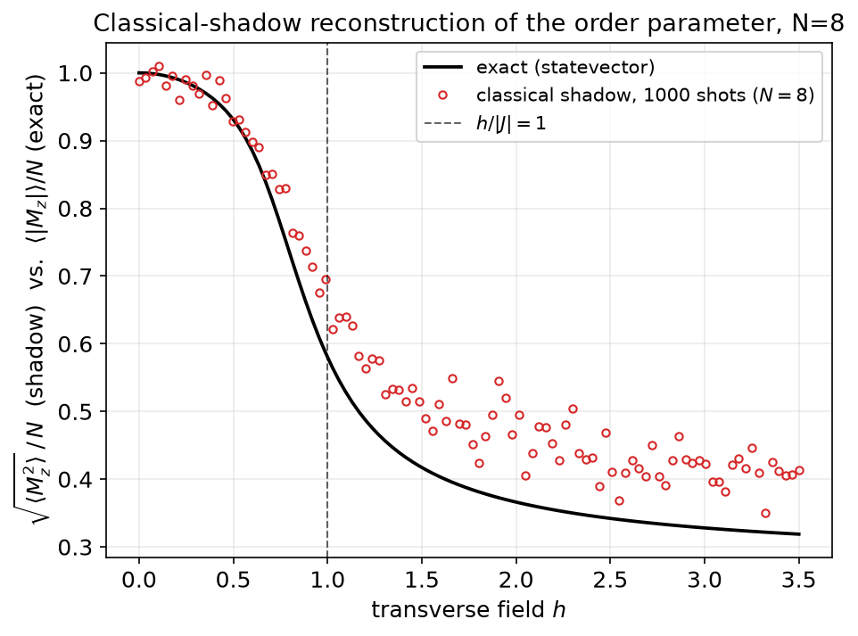

Reconstructing $\sqrt{\langle M_z^2\rangle}$ from the 1000-shot classical
shadow at every field tracks the exact order parameter closely through both
phases despite the shot noise, with the largest scatter (as expected) near
the transition where the ground state is most entangled and least
product-like. This is the report's one NISQ-realistic result: no statevector
was used, only the randomized single-qubit measurement outcomes a real
device would return.

### 6.5 VQE: hardware-efficient vs. physics-informed

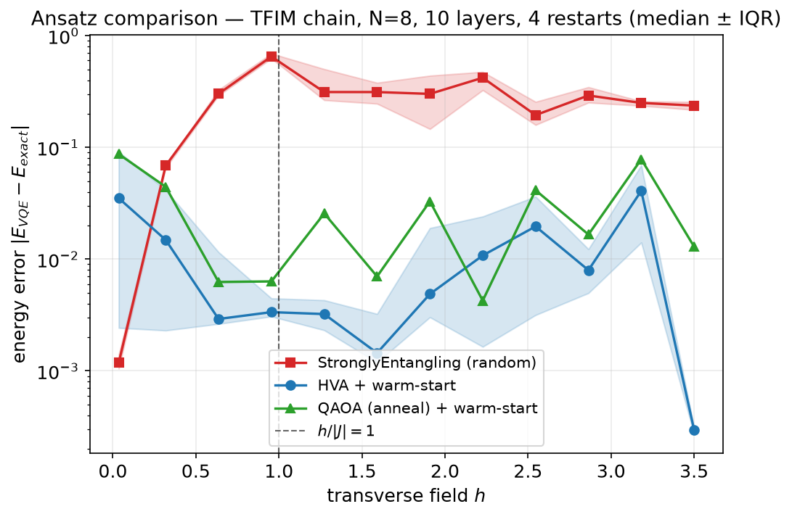

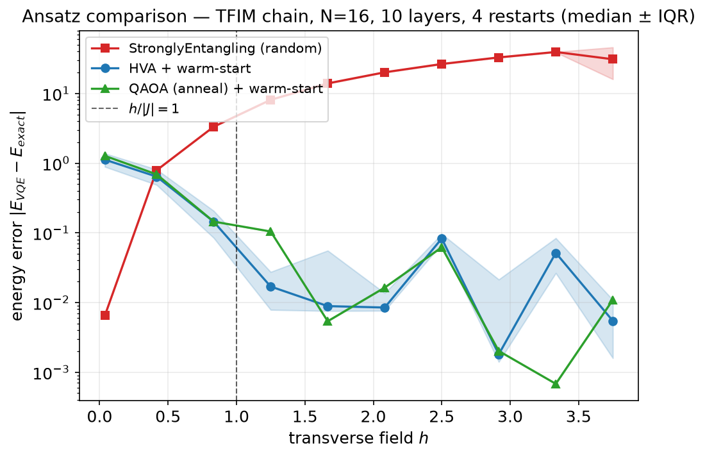

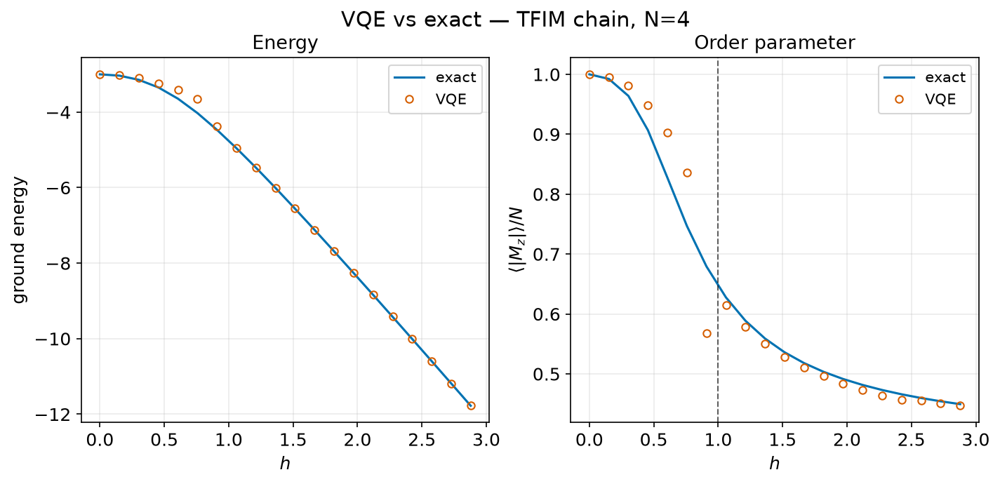

Each curve is the median over four independent random restarts, with the shaded
inter-quartile band showing the restart-to-restart spread. At $N=8$ the generic
`StronglyEntanglingLayers` ansatz (HEA) reaches a median absolute energy error
of $2.8\times10^{-1}$ across the field sweep; the Hamiltonian Variational Ansatz
(HVA), built from the dataset's own Hamiltonian and warm-started across the
sweep, reaches $1.2\times10^{-2}$ (and $1.8\times10^{-3}$ best-of-restarts) — a
$\approx23\times$ improvement. The gap *widens* with system size: at $N=16$ the
HEA median error is $1.8\times10^{1}$ (it has effectively stopped learning,
Sec. 6.6) against the HVA's $2.1\times10^{-1}$, a $\approx85\times$ separation.

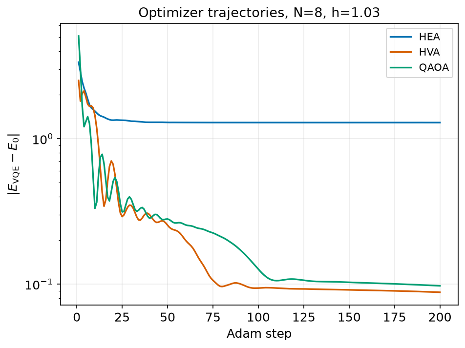

The optimizer-trajectory comparison shows *why*: HEA's energy error plateaus
early at a much higher value, while HVA/QAOA continue descending — the
endpoint comparison alone understates how much more the generic ansatz is
struggling, not just where it ends up.

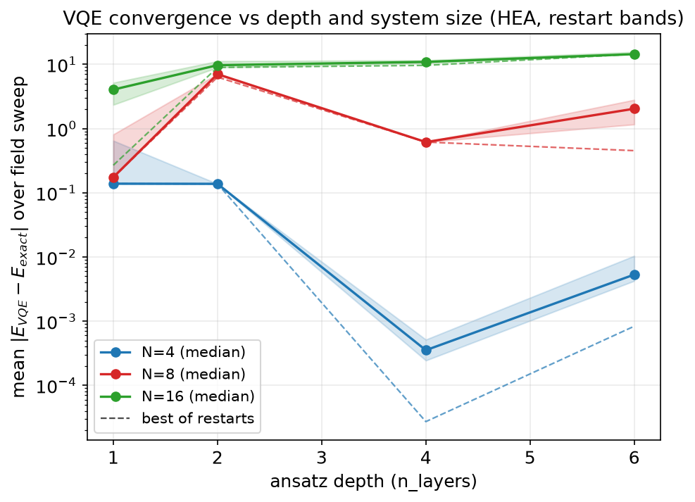

Sweeping the HEA alone over circuit depth exposes the same failure from a
different angle. With convergence-based training (so depth is not confounded
with a fixed step budget) and restart bands, adding layers helps only at the
smallest size ($N=4$ improves through depth 4); by $N=16$ the median error
*grows* with depth ($4.0\to9.7\to10.9\to14.4$ for depths $1,2,4,6$) — adding
expressibility to a generic ansatz makes the landscape flatter and harder to
train, not better, the operational signature of the barren plateau quantified
next.

### 6.6 QAOA and trainability

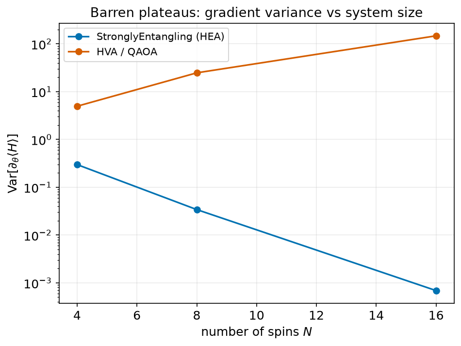

QAOA (the same HVA circuit, annealing-inspired initialization) reaches lower
energy error than random initialization at the same depth. The gradient-
variance diagnostic, now averaged over every gradient component rather than
one fixed angle, shows HEA's variance collapsing with $N$
($0.298\to0.034\to6.9\times10^{-4}$ for $N=4,8,16$) — a barren plateau —
while HVA/QAOA's variance *grows* with $N$ ($5.0\to24.8\to147.3$), confirming
the physics-informed ansatz remains trainable at the sizes accessible here.

### 6.7 2D lattices

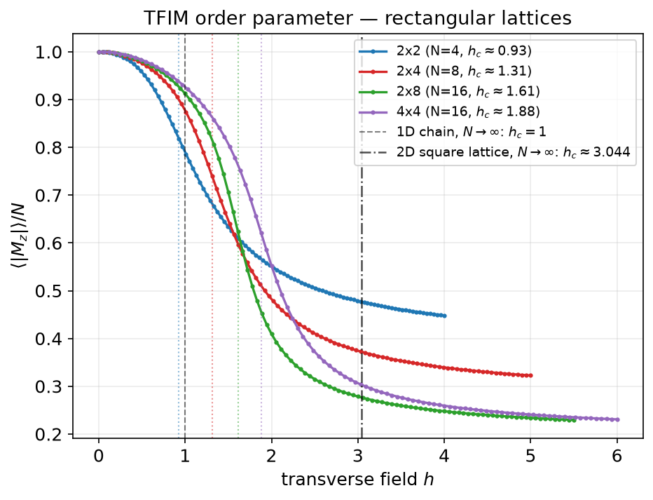

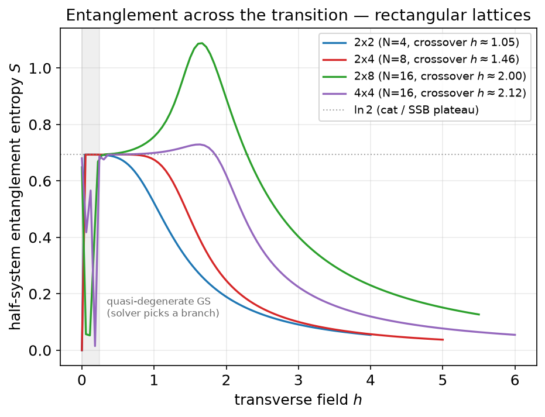

The finite-size critical field grows monotonically with the lattice's
connectivity, from $h_c\approx0.93$ (`2x2`, a 4-site ladder) through $1.31$
(`2x4`), $1.61$ (`2x8`), to $1.88$ (`4x4`, the only genuine small square
lattice) — trending toward, but still far below, the thermodynamic 2D-square
value $h_c\approx3.044$, as expected at these small sizes. The shaded
near-$h=0$ band in the entropy panel is the same quasi-degenerate-ground-state
artifact as Sec. 6.2, more pronounced here since the two $N=16$ lattices
(`2x8`, `4x4`) have the smallest finite-size tunnelling gap of any system in
this report.

## 7. Finite-size scaling and the critical point

### 7.1 Open vs. closed boundary conditions

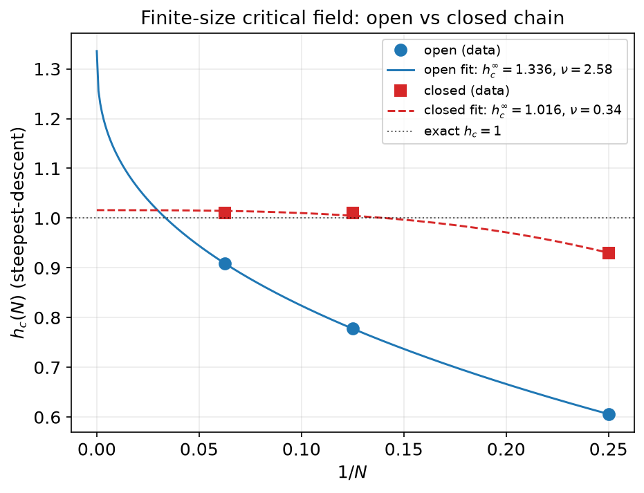

The steepest-descent $h_c$ estimate on the open chain drifts from $0.61$
($N=4$) to $0.78$ ($N=8$) to $0.91$ ($N=16$) — still visibly short of $1$ at
$N=16$. The same estimator on the closed (periodic) chain gives $0.93$,
$1.01$, $1.01$ — already within a percent of the exact value at $N=8$.
Periodic boundaries remove the two chain ends
that otherwise contribute a finite-size correction, so this direction
converges markedly faster than the open chain at matched $N$. (The three-point
power-law fits used to extrapolate $h_c(\infty)$ are exact interpolations,
not statistically meaningful regressions — with only the three available
chain sizes, they should be read as a qualitative trend, not an error-barred
result.)

### 7.2 Summary of critical-point evidence

Across the three independent *methods* used here — exact diagonalization from
the dataset, the analytic Jordan-Wigner solution, and variational (VQE)
reconstruction — four separate finite-size *probes of the critical field* now
converge on $h_c\approx1$: the magnetization inflection and Binder-cumulant
crossing (Sec. 6.1), the entanglement crossover and (once refit on the periodic
chain) central charge $c\approx0.5$ (Sec. 6.2), the Jordan-Wigner gap closing
(Sec. 6.3), and — extending the scope beyond the original 1D chain — the 2D
lattices' critical field growing with connectivity in the direction of the
known square-lattice value (Sec. 6.7).

## 8. Discussion & conclusions

The dataset's exact diagonalization, an independent analytic (Jordan-Wigner)
solution, and our own VQE reconstruction all agree on the same physics: a
single quantum phase transition at $h/|J|=1$ on the 1D chain, sharpening with
system size and shifting to larger $h$ as lattice connectivity increases
toward the 2D square lattice.

The central-charge investigation is the report's clearest methodological
lesson: a persistent $\sim20\%$ bias against known CFT theory was not a
mistake in the fitting code, but a real finite-size effect tied specifically
to the open chain's two boundaries; refitting the identical procedure on
periodic data at the *same* system sizes recovered the expected value to a
few percent. The same boundary sensitivity shows up independently in the
critical-field extrapolation (Sec. 7.1), where periodic boundaries converge
markedly faster — both results point the same way: open-chain finite-size
corrections in this model are large and boundary-dominated, not just
$O(1/N)$ bulk corrections.

On the variational side, the physics-informed HVA's energy-accuracy advantage
over a generic hardware-efficient ansatz — $\approx23\times$ at $N=8$, widening
to $\approx85\times$ at $N=16$ as HEA stops learning entirely — together with
its qualitatively different (growing rather than vanishing) gradient variance,
is consistent with the broader trainability literature: encoding problem
structure into the ansatz is not just a speed-up but changes whether the
optimization landscape is trainable at all as $N$ grows. The classical-shadow
reconstruction (Sec. 6.4) demonstrates the same physics is, in principle,
recoverable from measurement statistics a real NISQ device would produce, with
no access to the full statevector — the most experimentally realistic result
in the report.

**Limitations.** The critical-field power-law extrapolations rest on only
three chain sizes, so the fitted $\nu$ exponents (Sec. 7.1) should not be
over-interpreted. The 2D lattices are too small to approach their
thermodynamic-limit critical field, and three of the four rectangular systems
are quasi-1D ladders rather than genuine square lattices. The classical-shadow
estimator targets $\sqrt{\langle M_z^2\rangle}$, a proxy for
$\langle\lvert M_z\rvert\rangle$ that is exact only when the ground state's
magnetization is sharply two-valued.

## References
- PennyLane datasets: https://pennylane.ai/datasets/transverse-field-ising-model
- S. Sachdev, *Quantum Phase Transitions*, Cambridge University Press.
  Definitions of first-order/continuous QPTs via non-analyticity of the
  ground-state energy (Sec. 3.3), and the $(g,T)$ phase diagram with a
  quantum critical point and quantum critical region (Sec. 3.4).
- S. Suzuki, Jun-ichi Inoue, B. K. Chakrabarti, *Quantum Ising Phases and
  Transitions in Transverse Ising Models*, Springer. Two solvable limits of
  the TFIM (Sec. 3.3) and the Suzuki-Trotter quantum-to-classical mapping of
  the 1D quantum chain onto the 2D anisotropic classical Ising model
  (Sec. 3.4).
- H. Nishimori, G. Ortiz, *Elements of Phase Transitions and Critical
  Phenomena*, Oxford. Classical background: Ehrenfest classification, Landau
  theory, critical exponents, the Ginzburg criterion, and the domain-wall
  argument for the absence of a 1D finite-temperature transition (Sec. 2).
- L. Onsager, "Crystal Statistics. I. A Two-Dimensional Model with an
  Order-Disorder Transition," *Phys. Rev.* 65, 117 (1944). Exact solution of
  the 2D classical Ising model, used via the quantum-to-classical mapping to
  derive the exact 1D quantum critical point $g_c=1$ (Sec. 3.4).
- J. I. Cirac, "Entanglement in many-body quantum systems," in *Many-Body
  Physics with Ultracold Gases* (École de Physique des Houches 2010),
  Oxford. Schmidt decomposition, entropy of entanglement, and the area law
  (Sec. 3.5).
- P. Calabrese, J. Cardy, "Entanglement Entropy and Quantum Field Theory,"
  *J. Stat. Mech.* P06002 (2004). Exact entanglement entropy of the TFIM
  ground state in closed form (elliptic integrals), including the $\ln2$
  ordered-phase plateau from the two-fold symmetry-broken ground-state
  degeneracy (Sec. 3.5) reproduced in our own data (Sec. 6.2).
- P. Calabrese, J. Cardy, "Unusual Corrections to Scaling in Entanglement
  Entropy," [arXiv:1002.4353](https://arxiv.org/abs/1002.4353). Derives the
  subleading corrections to the Calabrese-Cardy entropy formula from bulk and
  boundary irrelevant operators (including the semi-infinite/open-chain case);
  the likely source of our N=8,16 central-charge bias ($c\approx0.62$ vs the
  CFT value $1/2$) — see the note in `PLAN.md`.
- PennyLane demo, "Seeing quantum phase transitions with quantum computers,"
  https://pennylane.ai/demos/tutorial_quantum_phase_transitions — VQE +
  hardware-efficient ansatz on the 1D/2D TFIM, same $J/h=1$ transition; a
  useful cross-check baseline against our HVA/QAOA results.
- L. Bittel, M. Kliesch et al. framework; see also A. Holmes et al.,
  "Connecting Ansatz Expressibility to Gradient Magnitudes and Barren
  Plateaus," [arXiv:2101.02138](https://arxiv.org/abs/2101.02138), *PRX
  Quantum* 3, 010313 (2022). Formalizes the expressibility/trainability
  trade-off behind our `trainability.py` finding that HEA decays with $N$
  while HVA/QAOA stay $O(1)$.
- D. Wecker, M. B. Hastings, M. Troyer, "Progress towards practical quantum
  variational algorithms," *Phys. Rev. A* 92, 042303 (2015),
  [arXiv:1507.08969](https://arxiv.org/abs/1507.08969) — the origin of the
  Hamiltonian Variational Ansatz used for our HVA/QAOA circuits, motivated by
  Trotterized adiabatic state preparation.
- K. Binder, "Finite size scaling analysis of ising model block distribution
  functions," Z. Phys. B 43, 119 (1981) — origin of the Binder-cumulant
  crossing method used in `binder_crossing`; for a TFIM-specific derivation of
  the crossing-drift correction see the finite-size-scaling literature cited
  from arXiv:2103.09469 (quantum Monte Carlo, long-range TFIM).
